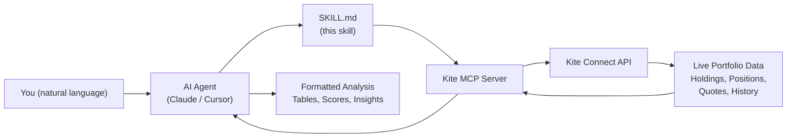

# AI Portfolio Manager — Zerodha Kite MCP Skill

**Turn your AI coding assistant into a personal wealth manager.** This skill connects Claude Code or Cursor to your live Zerodha (Kite) account via MCP, giving you instant portfolio analysis, stock deep-dives, sector breakdowns, and actionable investment insights — all from a single prompt.

> *"Analyze my portfolio"* — and your AI does the rest.

---

## Why This Exists

Indian retail investors on Zerodha manage lakhs to crores through the Kite platform, but analyzing a diversified portfolio — equities, mutual funds, gold ETFs, SGBs, NCDs, government securities — takes time and spreadsheet gymnastics.

This skill teaches AI agents to do it for you. It pulls live data from your Kite account through the [Kite MCP Server](https://github.com/developer-ishan/kite-mcp-server), classifies every holding, computes health scores, flags risks, and delivers a comprehensive analysis in seconds.

No more switching between apps. No more manual calculations. Just ask.

---

## Features

### 7 Analysis Modes

| Mode | What You Get | Example Prompt |
|------|-------------|----------------|
| **Full Portfolio Overview** | Asset allocation, health score (0–100), P&L attribution, sector exposure, position sizing flags, recovery distances, best/worst performers | *"Analyze my portfolio"* |
| **Single Stock Deep-Dive** | Current price, 50/200-day SMAs, 52-week range, trend analysis, your holding P&L | *"Analyze RELIANCE"* |
| **Sector Breakdown** | Sector-wise value, concentration %, sector P&L | *"Show my sector exposure"* |
| **Mutual Fund Review** | Fund-by-fund performance, category breakdown, overlap detection with direct equity | *"How are my mutual funds doing?"* |
| **Stock Comparison** | Side-by-side technicals, returns, and portfolio weight for 2+ stocks | *"Compare HDFC and ICICI"* |
| **Historical Price Analysis** | OHLC trends, key levels, return over any period | *"Price history of SBIN last year"* |
| **P&L Attribution** | Top gainers/losers ranked by absolute contribution to total P&L | *"Where am I making money?"* |

### Portfolio Health Score

A proprietary 0–100 composite score evaluating:

- **Diversification** (25 pts) — Herfindahl-Hirschman Index on holding weights
- **Concentration Risk** (25 pts) — Top holding as % of portfolio
- **Win Rate** (25 pts) — Ratio of profitable vs losing positions
- **Asset Mix** (25 pts) — Spread across asset classes (equity, debt, commodity)

### Smart Asset Classification

Automatically classifies every instrument in your Kite account:

- **Direct Equity** — Individual stocks
- **Mutual Funds** — With category inference (Large Cap, Flexi Cap, Small Cap, Sectoral, Debt)
- **Gold** — GOLDBEES ETF + Sovereign Gold Bonds (SGB prefix)
- **Silver** — SILVERBEES ETF
- **Fixed Income** — NCDs with coupon rate extraction + Government Securities
- **Positions** — Intraday and delivery trades from today

### Actionable Insights

Every analysis ends with:
- **Key Observations** (7–10 data-backed insights)
- **Actionable Considerations** (specific next steps — what to trim, review, or add)
- Recovery distance calculations for losing positions
- MF overlap alerts when direct equity duplicates fund exposure
- Position sizing warnings for oversized (>8%) and undersized (<1%) holdings

---

## How It Works



1. **You ask** a question in natural language (*"Analyze my portfolio"*).
2. **The AI agent** matches your request to this skill's trigger phrases.
3. **The skill** instructs the agent which Kite MCP tools to call and in what order.
4. **The MCP server** authenticates with Kite Connect and fetches live data.
5. **The agent** classifies holdings, computes metrics, and returns a structured analysis.

---

## Prerequisites

1. **Zerodha Account** — Active trading account with Kite access.
2. **Kite MCP Server** — A running instance of the [Kite MCP Server](https://github.com/developer-ishan/kite-mcp-server) that bridges AI agents to the Kite Connect API.
3. **Claude Code or Cursor** — An AI coding assistant that supports MCP and skills.

---

## Installation

### Step 1: Set Up the Kite MCP Server

Follow the [Kite MCP Server setup guide](https://github.com/developer-ishan/kite-mcp-server) to get the server running. You will need your Kite Connect API key and secret.

### Step 2: Install the Skill

Choose your platform:

<details>
<summary><strong>Claude Code</strong></summary>

**Copy the skill files:**

```bash
cp -r claude-code/ ~/.claude/skills/portfolio-analysis/
```

**Add the MCP server** to `~/.claude/mcp.json` (or your project's `.mcp.json`):

```json
{
  "mcpServers": {
    "kite": {
      "command": "npx",
      "args": ["-y", "kite-mcp-server"],
      "env": {
        "KITE_API_KEY": "your_api_key",
        "KITE_API_SECRET": "your_api_secret"
      }
    }
  }
}
```

> Adjust the `command` and `args` based on how you run the Kite MCP server (npx, Docker, local binary, etc.).

**Verify:** Open Claude Code and say *"Analyze my portfolio"*. The agent will authenticate with Kite and produce a full analysis.

</details>

<details>
<summary><strong>Cursor</strong></summary>

**Copy the skill files:**

```bash
# Global (all projects)
cp -r cursor/ ~/.cursor/skills/portfolio-analysis/

# Or workspace-level (this project only)
cp -r cursor/ .cursor/skills/portfolio-analysis/
```

**Add the MCP server** to `.cursor/mcp.json`:

```json
{
  "mcpServers": {
    "kite": {
      "command": "npx",
      "args": ["-y", "kite-mcp-server"],
      "env": {
        "KITE_API_KEY": "your_api_key",
        "KITE_API_SECRET": "your_api_secret"
      }
    }
  }
}
```

> You can also add MCP servers via **Cursor Settings > MCP**.

**Verify:** Open Cursor Agent and say *"Analyze my portfolio"*. The agent will authenticate with Kite and produce a full analysis.

</details>

### Step 3: Authenticate

On first use, the skill calls `login` which returns a Kite authorization URL. Click the link, log in to Zerodha, and the session is established. Subsequent requests reuse the session until it expires.

---

## Sample Output (Trimmed)

Here's a glimpse of what the Full Portfolio Overview produces:

```
## Portfolio Analysis — John Doe (AB1234)
Date: 10 Apr 2026 | Broker: ZERODHA

### Portfolio Summary
| Metric              | Value (INR) |
|---------------------|-------------|
| Total Portfolio Value | 12,45,678  |
| Total Invested       | 10,50,000  |
| Total P&L            | +1,95,678  |
| Overall Return       | +18.6%     |
| Cash Available       | 45,230     |

### Portfolio Health Score: 72/100 — Good
| Factor         | Score | Detail                              |
|----------------|-------|-------------------------------------|
| Diversification| 20/25 | HHI: 0.06 — well diversified       |
| Concentration  | 20/25 | Top holding: 11.2% of portfolio     |
| Win Rate       | 17/25 | 22 of 32 positions profitable (69%) |
| Asset Mix      | 15/25 | 3 asset classes with ≥10% allocation|

### Asset Allocation
| Asset Class      | Current Value | % of Portfolio |
|------------------|---------------|----------------|
| Direct Equity    | 7,20,000      | 57.8%          |
| Mutual Funds     | 2,10,000      | 16.9%          |
| Gold (ETF + SGB) | 1,45,000      | 11.6%          |
| Fixed Income     | 95,000        | 7.6%           |
| ...              | ...           | ...            |

### Key Observations
1. Portfolio health is Good at 72/100 — diversification is strong...
2. Precious metals contributed 46% of total gains...
3. ...

### Actionable Considerations
- Review SAFARI (-31%) — needs +44.9% rally to break even...
- Trim NATIONALUM (+106%) — oversized at 9.2% of equity...
- ...

*This is data-driven analysis, not financial advice.
Consult a SEBI-registered advisor before making investment decisions.*
```

---

## Supported Instruments

| Instrument Type | Detection Method | Examples |
|-----------------|-----------------|----------|
| Stocks | Direct equity holdings | RELIANCE, ITC, HDFCBANK |
| ETFs | Symbols ending in `BEES` | GOLDBEES, SILVERBEES |
| Sovereign Gold Bonds | `SGB` prefix | SGBAUG29, SGBMAR28 |
| NCDs | Numeric prefix + company code | 1140IRWL27, 1250SFPL26 |
| Government Securities | `-GS` suffix or `GS` in symbol | 699GS2026 |
| Mutual Funds | Via `get_mf_holdings` API | Any Kite-linked MF folio |

---

## Kite MCP Tools Used

| Tool | Purpose |
|------|---------|
| `login` | Authenticate with Kite Connect |
| `get_profile` | Account info |
| `get_holdings` | Long-term equity holdings |
| `get_positions` | Intraday and delivery positions |
| `get_mf_holdings` | Mutual fund holdings |
| `get_margins` | Cash and margin balances |
| `get_quotes` | Real-time market snapshots |
| `get_ltp` | Last traded price |
| `get_ohlc` | Day's OHLC data |
| `get_historical_data` | Historical candles (any interval) |
| `search_instruments` | Find instrument tokens by name/symbol |

For full tool schemas and argument details, see [`reference.md`](claude-code/reference.md).

---

## FAQ

**Q: Is my Zerodha password shared with the AI?**
No. Authentication happens through Kite Connect's OAuth flow. You log in directly on Zerodha's website. The MCP server only receives a session token.

**Q: Can the AI place trades on my behalf?**
This skill is **read-only** — it only fetches data for analysis. No order placement, modification, or cancellation tools are included.

**Q: Does it work with brokers other than Zerodha?**
Currently, this skill is built for Zerodha's Kite platform via the Kite MCP Server. Supporting other brokers would require a different MCP server.

**Q: How accurate are the technical indicators?**
SMAs and trend signals are computed from live historical candle data. They match what you would calculate manually from the same OHLC data. They are not a substitute for professional technical analysis tools.

---

## Disclaimer

This skill provides **data-driven analysis, not financial advice**. All outputs are generated from live market data and mathematical computations. Always consult a **SEBI-registered investment advisor** before making investment decisions.

---

## License

MIT

---

*Built with [Kite MCP Server](https://github.com/developer-ishan/kite-mcp-server) | Works with [Claude Code](https://docs.anthropic.com/en/docs/agents-and-tools/claude-code) and [Cursor](https://cursor.com)*
